本题是一个class文件。拖入ida中查看。

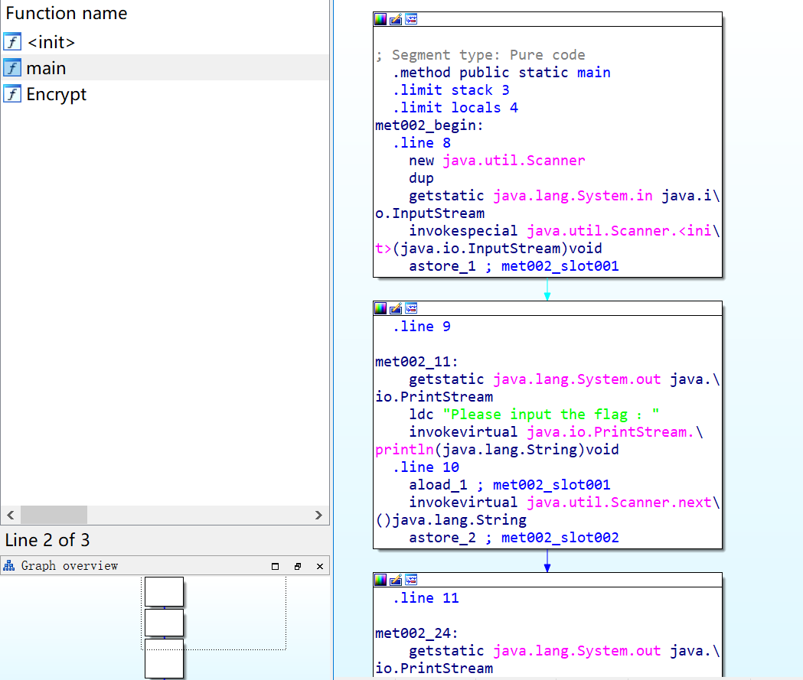

由于class文件没加密的话可以直接逆向，因此不用反汇编。文件很简单，只有三个方法，object的构造方法init，main方法和一个encrypt方法。

第一个block，看起来是从输入流中获取了一个东西放在了slot1中。

第二个block，打印了"请输入flag"，加载了slot1，然后获取下一个输入放在slot2中。

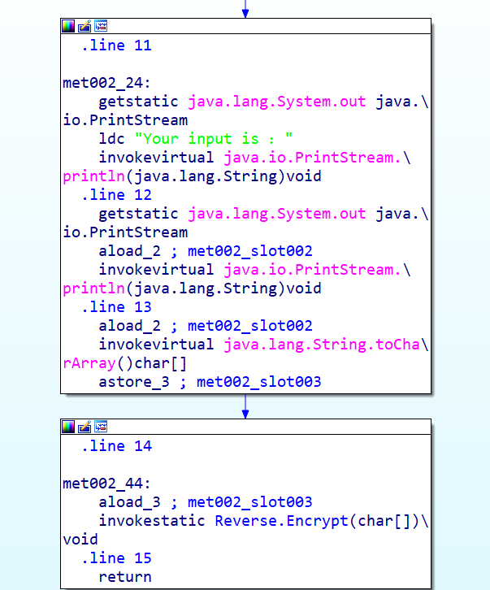

第三个block，重新打印了一遍输入的flag，然后把它转换成了char的array对象。

第四个block，把chararray传给了Encrypt函数。

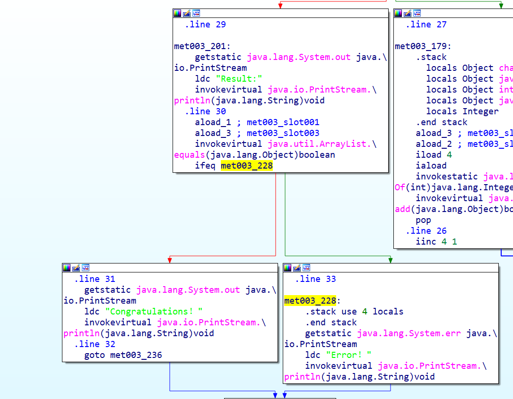

在Encrypt函数中，首先找到判断条件。看这个结构，应该会在**slot1和slot3中的两个arraylist是否相等**。如果不相等，则error，相等则完成条件。

从头开始看该函数。最大栈深度为4，局部变量有5个。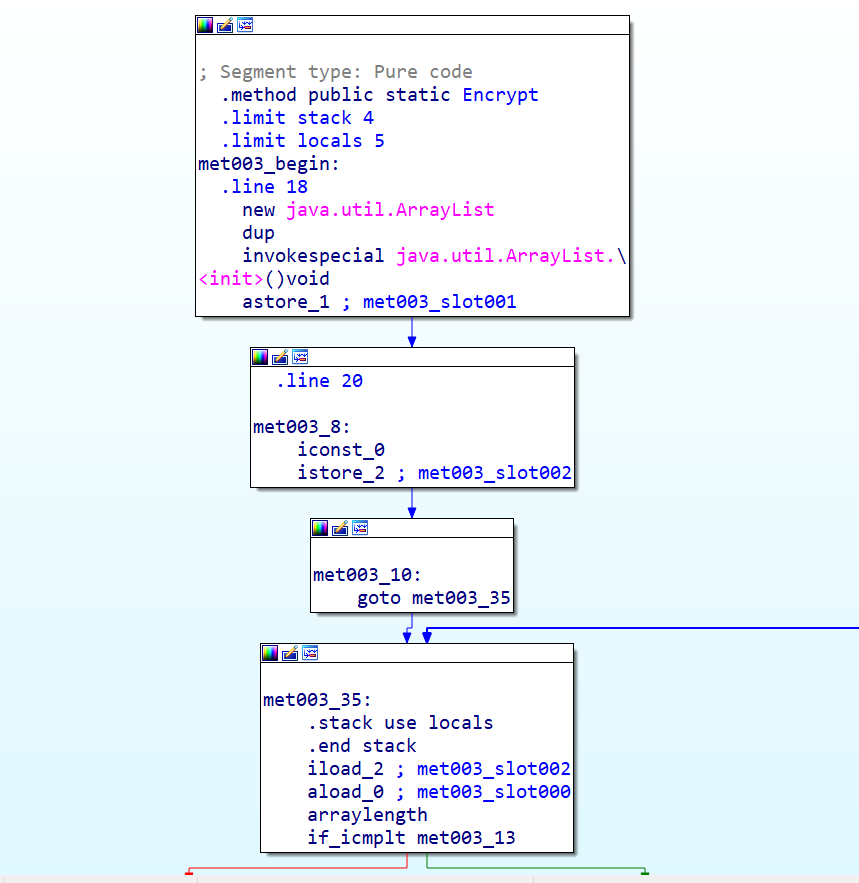

第一个块，new了一个Arraylist并存在slot1中。(arr1)

第二个块，将常量0压入栈，并存在slot2中。后面作为循环索引的变量。

第四个块，把slot2中的0压入栈，再把slot0中的形参arr1数组对象传给求长度的函数，并比较长度和slot2的大小。如果数组长度大于等于slot2（即遍历完了数组），就左边；如果小于slot就走右边。

右边是使用caload将arr1数组的索引为0（slot2）的位置取出来压栈，然后和64相加，再和32异或，放在slot3中。


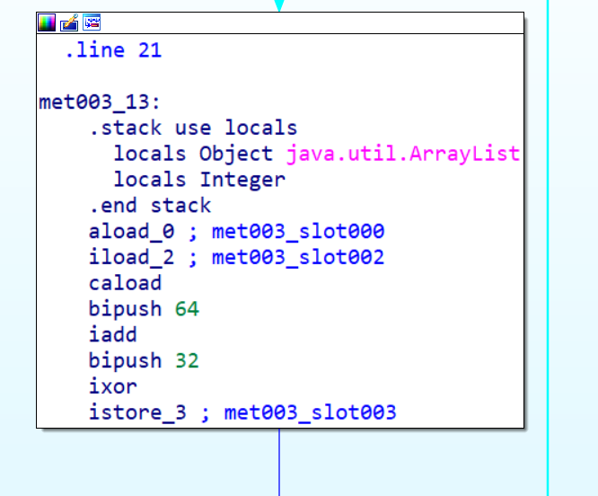

然后把slot3位置的数添加到slot1中的arraylist。接着循环遍历arr1数组，每一个都进行同样的操作。

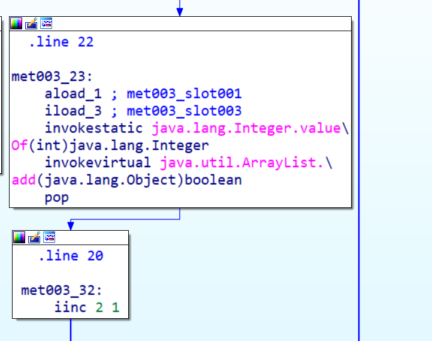

循环完了之后：arr1[i] = (char[i] + 64 ) ^ 32 

左边创建了一个长度为18的int数组，然后开始把指定的数字常量存入指定的索引位置（0-17，共18个）,最后把数组放到了slot2的位置中。
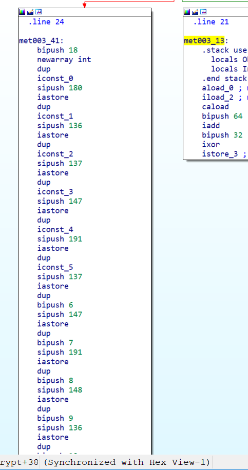

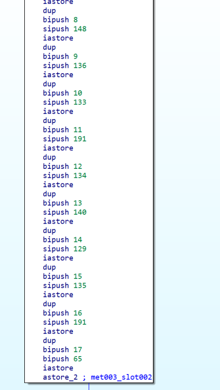

arr2[18] = {180, 136,137,147,191,137, 147, 191,148, 136, 133, 191,134,140,129,135,191,65}

接着new一个arraylist放在slot3中。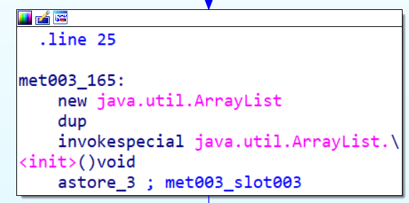

然后把0(index)放在slot4的位置，再遍历slot2数组。

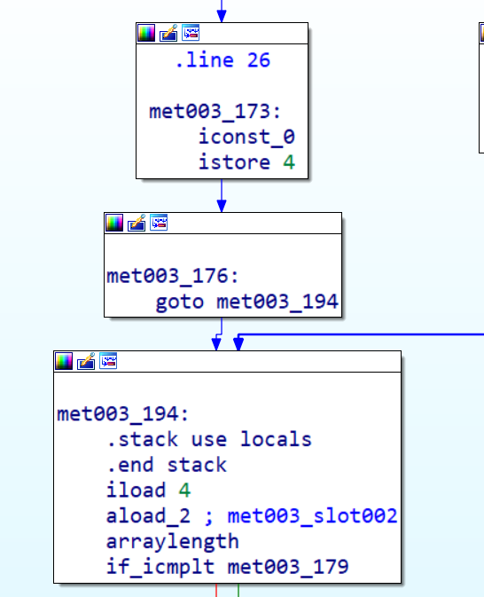

循环中对arr2数组进行如下操作：

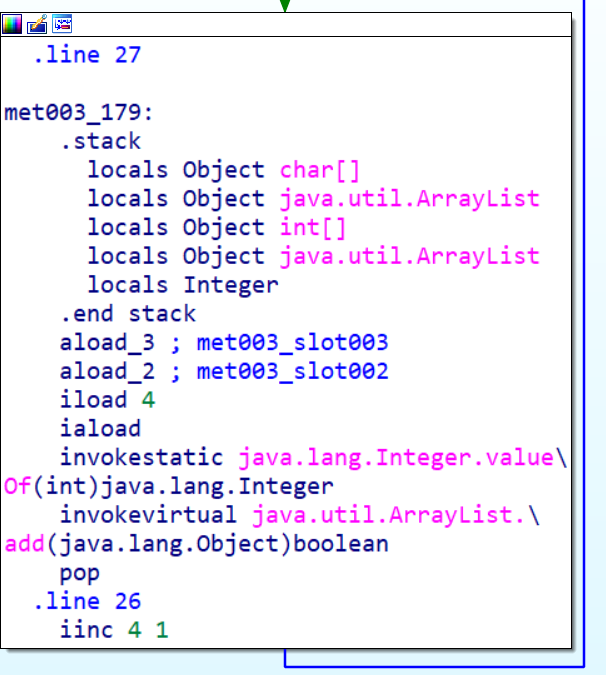

先load 新建的arr3，再load arr2[]，取出第i个元素，算出它的值，再添加到arr3[]中。也就是说，arr2 = arr3。

结束后则比较003和001中的值。

因此arr2[i] = (input[i] + 64 ) ^ 32 ， (input[i] = arr2[i] ^ 32 ) - 64

```python
arr2 = [180,136,137,147,191,137,147,191,148,136,133,191,134,140,129,135,191,65]
out = ""
for i in range(18):
    out += chr((arr2[i]^32) - 64)
print(out)
```

This_is_the_flag_!

