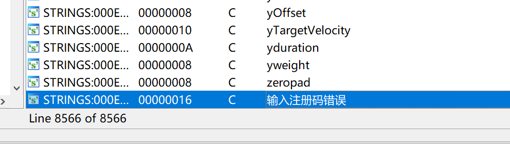
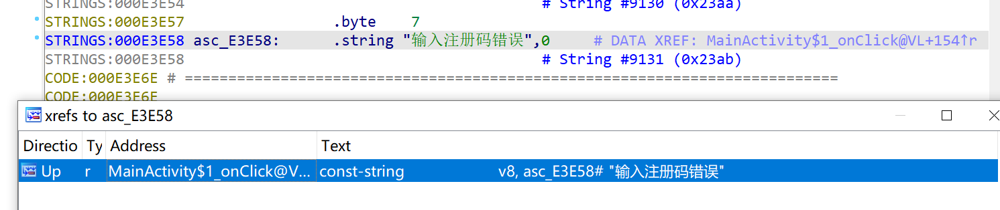
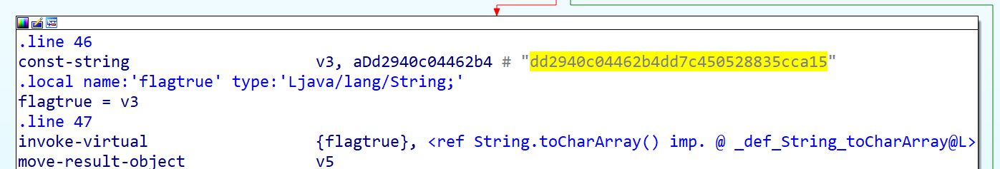
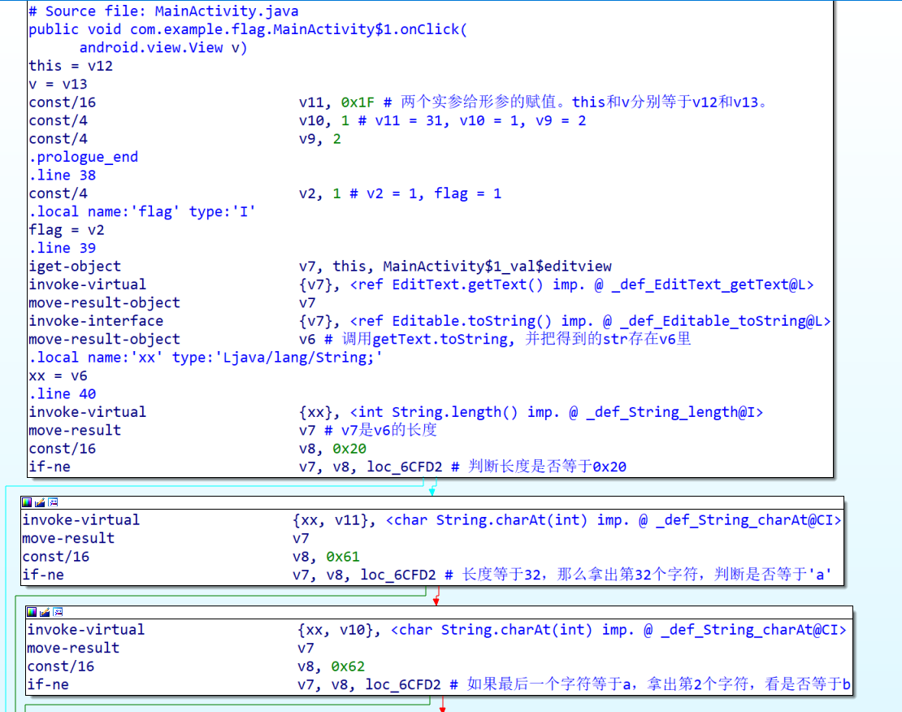
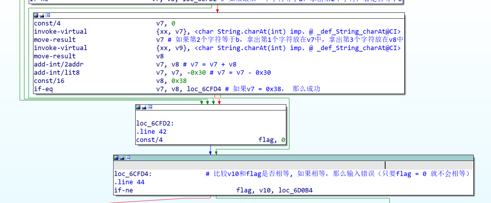
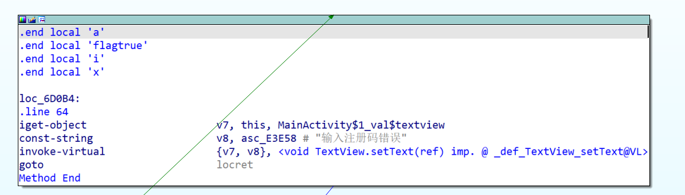
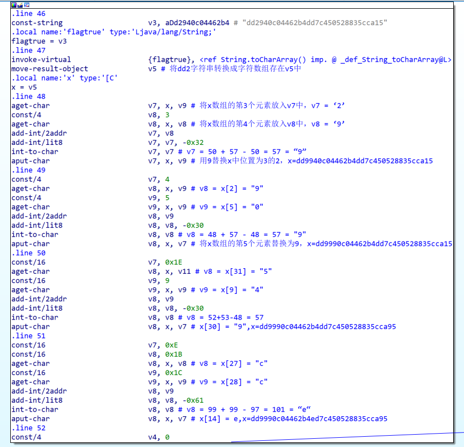
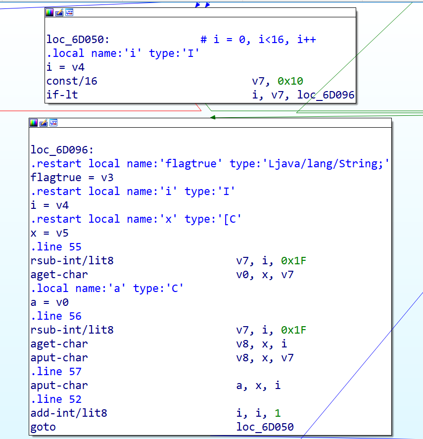
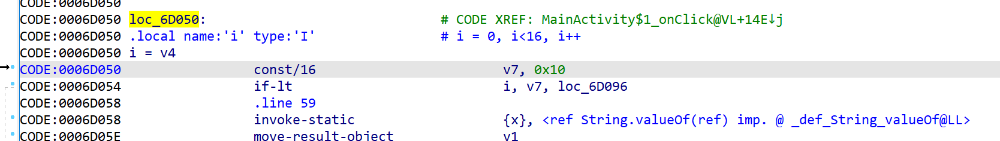

注：本wp存在头铁硬肝行为，请勿模仿。有更简单的直接反编译的安卓逆向工具，我因为是第一次做没有工具。

本题是一个64位的apk。拖入ida中查看，好复杂，看不懂。去string窗口看看。

看到了一个输入注册码错误，从交叉引用寻找它的位置





从函数名字也可以看出来MainActivity是主函数。

在里面找到一个字符串，先试试，不对。



那就慢慢看看函数逻辑。前面这些都没什么用，是验证注册码的。







核心函数区域：对dd2字符串进行处理。



循环部分：



需要注意的地方：

1. rsub-int/lit8 v7, i, 0x1f是v7 = **0x1f - i**， 和sub-int/lit8中的减数和被减数位置相反。
2. 作为一个循环，一开始看goto loc_6d050可能会觉得需要再执行一遍i = v4，v7 = 0x10，但那样会变成死循环；实际上应该从loc_6d054开始执行：



将上面的机器码还原成代码（头铁版本）：

```python
def str_to_ascii(str_list):
    str_list = list(str_list)
    for i in range(len(str_list)):
        str_list[i] = ord(str_list[i])
    return str_list

def ascii_to_str(str_list):
    str1 = ""
    for i in range(len(str_list)):
        str1 += chr(str_list[i])
    return str1

str1 = "4b44567890123456789012345678901a"
str1 = str_to_ascii(str1)
v11 = 0x1f
v10 = 1
v9 = 2
v2 = 1
flag = v2 
v6 = str1
xx = v6
v7 = len(str1)
v8 = 0x20
if v7 == v8 :
    v7 = xx[v11]
    v8 = 0x61
    if v7 == v8:
        v7 = xx[v10]
        v8 = 0x62
        if v7 == v8:
            v7 = 0
            v7 = xx[v7]
            v8 = xx[v9]
            v7 = v7 + v8
            v7 = v7 - 0x30
            v8 = 0x38
            if v7 == v8:
                flag = 0

if flag == v10:
    print("error")
else:
    v3 = "dd2940c04462b4dd7c450528835cca15"
    v3 = str_to_ascii(v3)
    flagtrue = v3
    v5 = flagtrue
    x = v5
    v7 = x[v9]
    v8 = 3
    v8 = x[v8]
    v7 = v7+v8
    v7 = v7 - 0x32
    x[v9] = v7

    v7 = 4
    v8 = x[v9]
    v9 = 5
    v9 = x[v9]
    v8 = v8+v9 - 0x30
    x[v7] = v8

    v7 = 0x1e
    v8 = x[v11]
    v9 = 9
    v9 = x[v9]
    v8 = v8+v9-0x30
    x[v7] = v8

    v7 = 0xe
    v8 = 0x1b
    v8 = x[v8]
    v9 = 0x1c
    v9 = x[v9]
    v8 = v9 + v8 - 0x61
    x[v7] = v8

    v4 = 0
    i = v4
    v7 = 0x10
    while i < v7:
        v7 = 0x1f - i
        v0 = x[v7]
        a = v0
        v7 = 0x1f - i
        v8 = x[i]
        x[v7] = v8
        x[i] = a
        i = i + 1
    v1 = ascii_to_str(x)
    bbb = v1
    v9 = "flag{"
    out = v9 + bbb + "}"
    print(out)
```

flag{59acc538825054c7de4b26440c0999dd}

简化后的代码：

```python
def str_to_ascii(str_list):
    str_list = list(str_list)
    for i in range(len(str_list)):
        str_list[i] = ord(str_list[i])
    return str_list

def ascii_to_str(str_list):
    str1 = ""
    for i in range(len(str_list)):
        str1 += chr(str_list[i])
    return str1

if __name__ == '__main__':
    v11 = 0x1f
    v10 = 1
    v9 = 2
    v3 = "dd2940c04462b4dd7c450528835cca15"
    v3 = str_to_ascii(v3)
    x = v3
    x[2] = x[2] + x[3] - 0x32  
    x[4] = x[2] + x[5]- 0x30
    x[0x1e] =x[0x1f] + x[9] - 0x30
    x[0xe] = x[0x1c] + x[0x1b] - 0x61

    i = 0
    while i < 0x10:
        a = x[0x1f - i]
        x[0x1f - i] = x[i]
        x[i] = a
        i = i + 1
    v1 = ascii_to_str(x)
    bbb = v1
    v9 = "flag{"
    out = v9 + bbb + "}"
    print(out)
```

