64位elf文件。打开进入之后发现没有叫main的函数，因此从start开始观察。

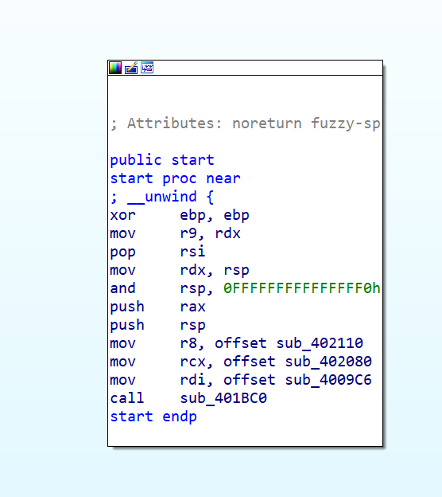

观察无果之后直接去string视图查看字符串。

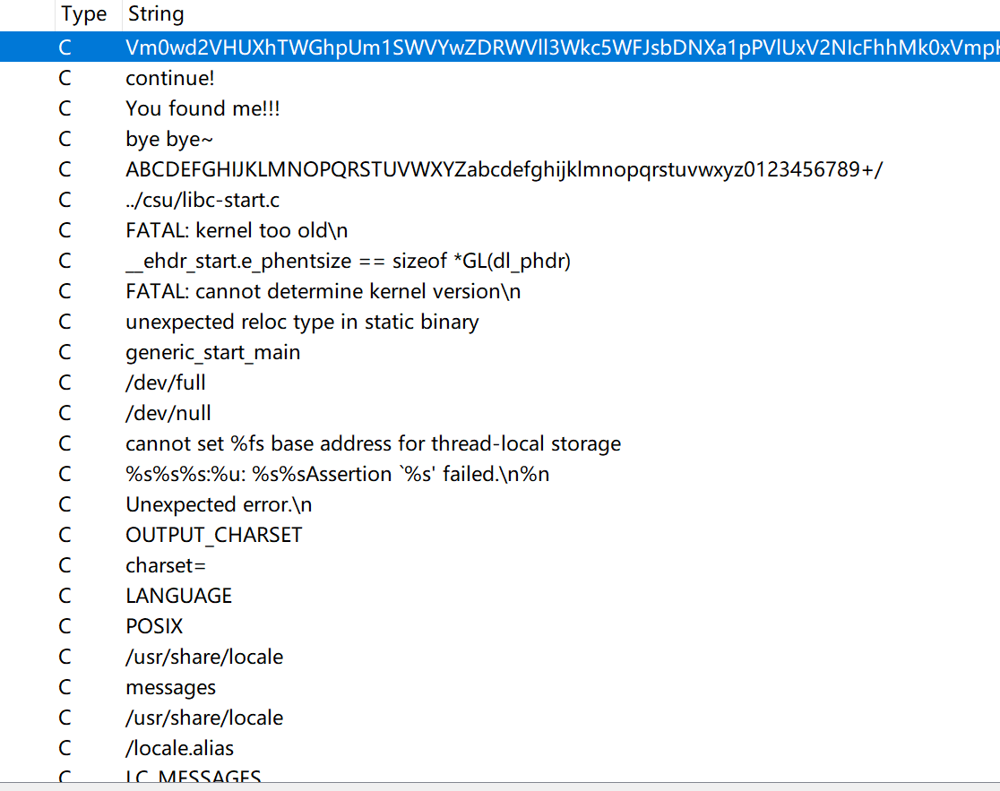

同时也发现了有使用base64编码。

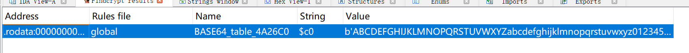

找到引用该字符串的位置

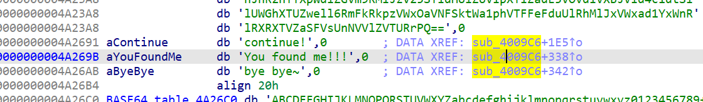

## 被坑预警

整个过程很复杂，先一点一点看，给函数命名。

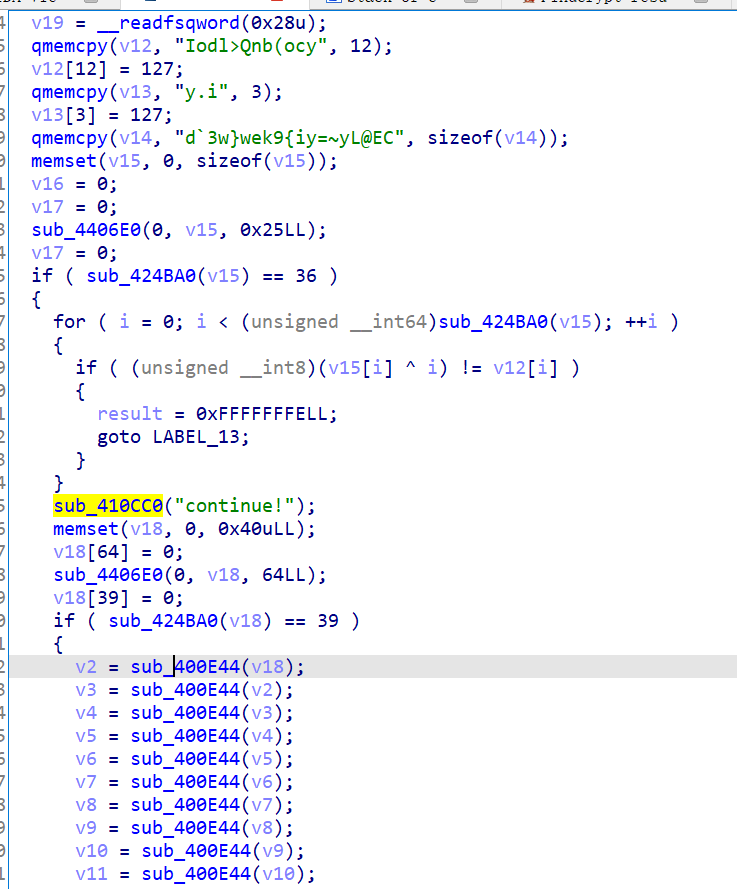

continue前面是第一部分：

sub_410cc0这个函数看起来像是打印的功能，于是给它改个名。

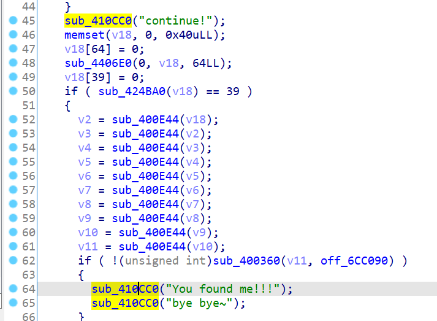


最底下的sub_444020也有点像输出字符串的功能，也改个名。

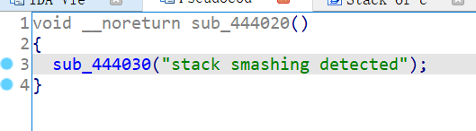

sub_4406e0函数似乎是系统调用sys_read，它的参数是文件描述符，读入的缓冲区和长度。

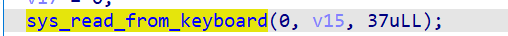

如果第一个参数是0，那么应该是标准输入流，从键盘读取。

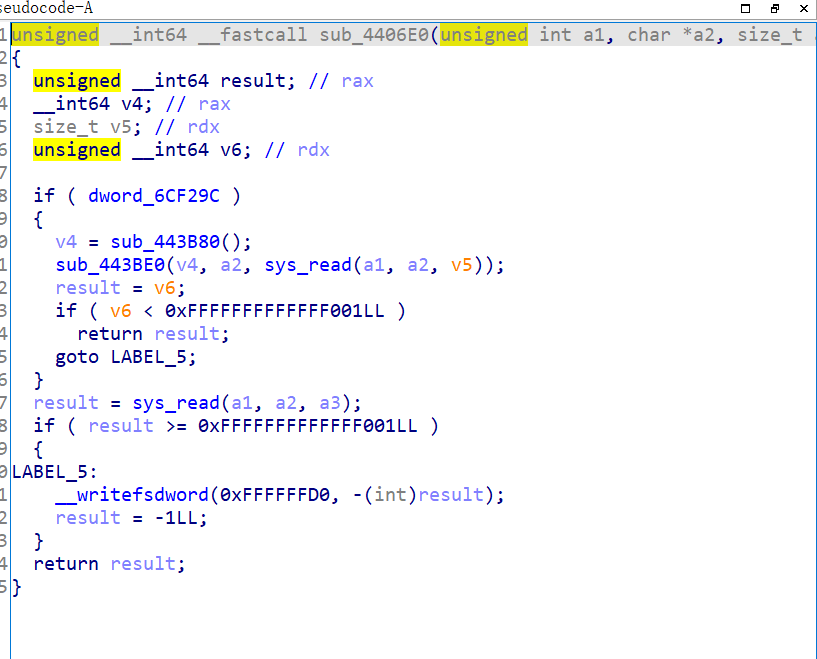


仔细观察sub_424ba0，发现很像是判断char*数组的长度的。下面的for循环的边界条件也说明了这一点。之前正好往v15中读入了0x25也就是37个字符。

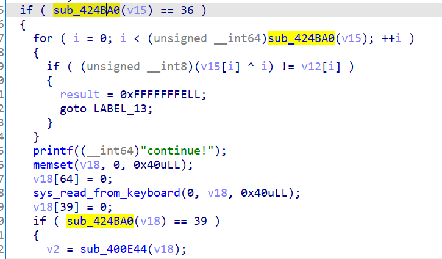


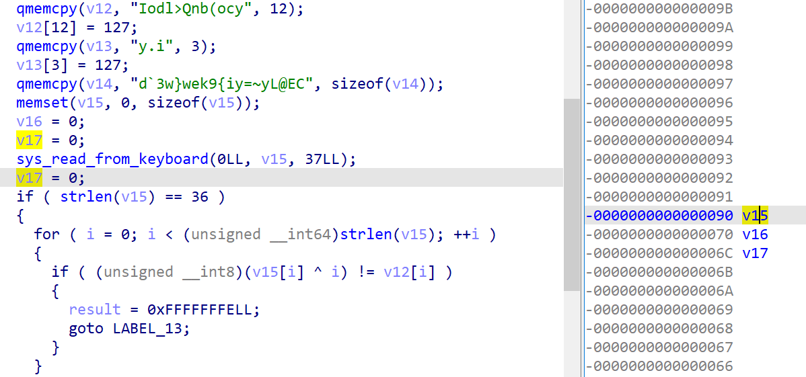

这样以v12为首地址的字符串就是：Iodl>Qnb(ocy+0x127+y.i+0x127+d`3w}wek9{iy=~yL@EC 加号不算，一共36个字符。观察这一段，是将v15每一项和索引异或之后和v12的每一项比较。**需要v15处理之后和v12的每一项相同。**

因此逆向逻辑就是v15[i]^i = v12[i]; v15[i] = v12[i]^i

```python
v12 = "Iodl>Qnb(ocy"+chr(127)+"y.i"+chr(127)+"d`3w}wek9{iy=~yL@EC"
v12 = list(v12)
v15 = ""
for i in range(36):
    v15 += chr(ord(v12[i])^i)
print(v15)
```

结果是：Info:The first four chars are `flag`

第二部分：输入的字符串存入v18，长度被截断为39，然后对v18进行一系列sub_400e44的操作，最后将v11和off_6cc090的字符串比较。

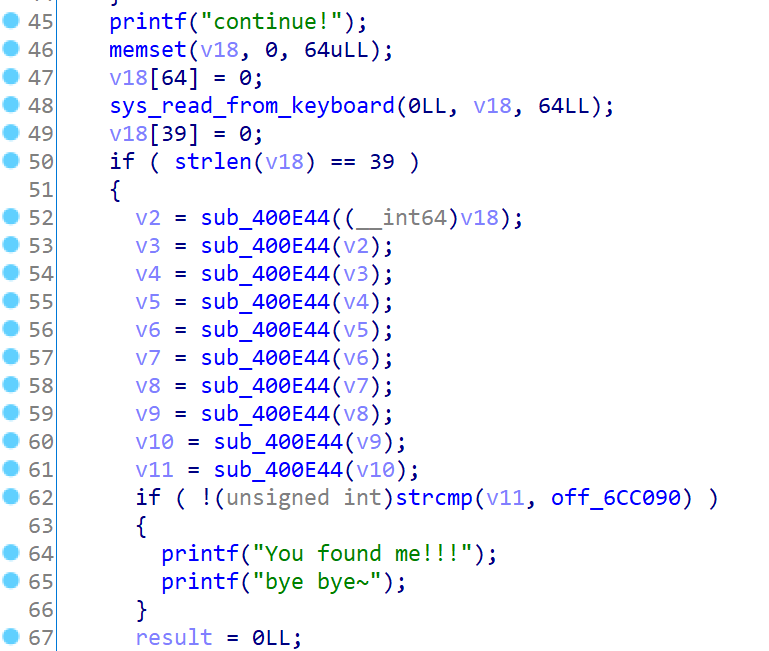

6cc090是这么长一串：

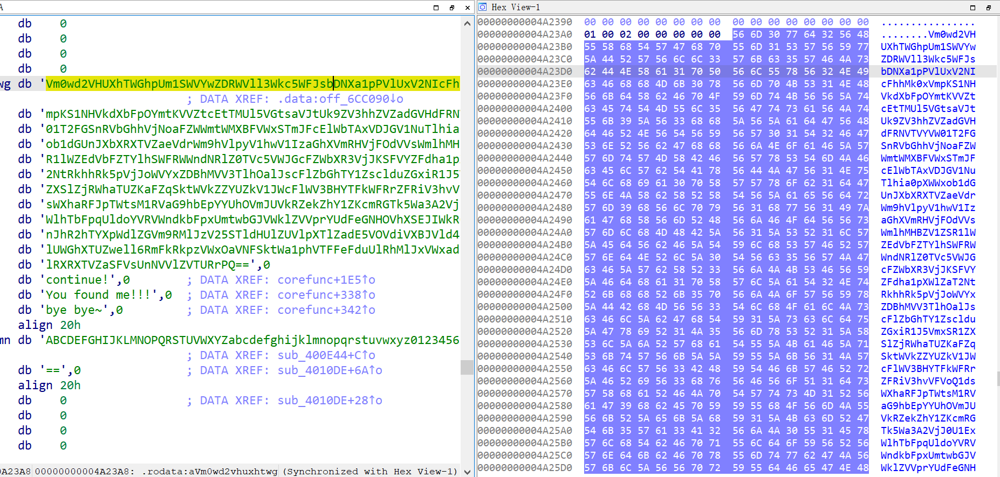

分析一下sub_400e44，看起来就是标准的base64：

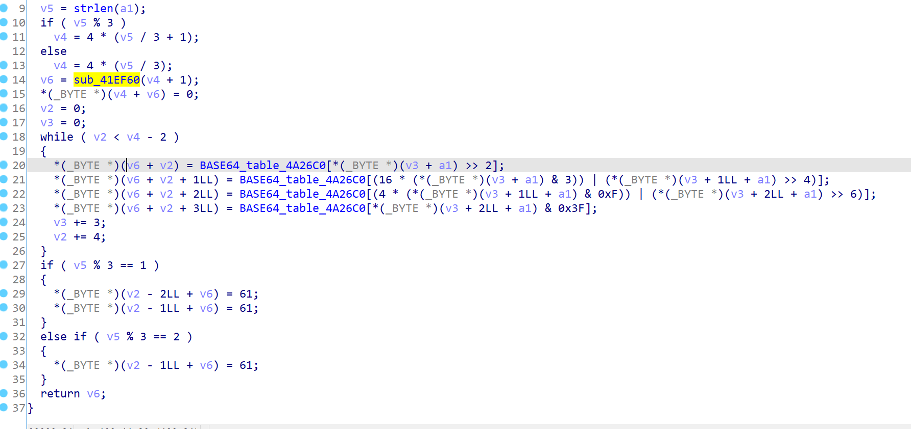

因此只要把最终的串放到base64解密里解密10次就行了。

解出来之后发现是个网址，**一开始没有仔细看内容**，但是看着也不是最终的flag。

**https://bbs.pediy.com/thread-254172.htm**

## 探究

***<u>一定要仔细看内容</u>*！！！看了之后就会了解出题者精心设计的思路。如何使用激励把破解者引到沟里去的心思真是非常之绝妙。从这个题目开始，逆向正式进入了攻防思路（而不是使用明显的线索追踪的思路）。**

我们再从头看这个题目。我是被一个字符串的线索引入这条路径的。如果不看这个字符串，应当从哪里开始分析呢？翻找了好多个wp，都没有合理的查看该函数的原因，也就是“如何将关键函数摆在破解者的面前”呢？最终有一篇wp提醒了我：https://blog.csdn.net/qq_44625297/article/details/105155727

在最开始的时候，是找不到main的，只能看start。而障眼法函数恰好在start里被调用了：（corefunc是我改的名字）

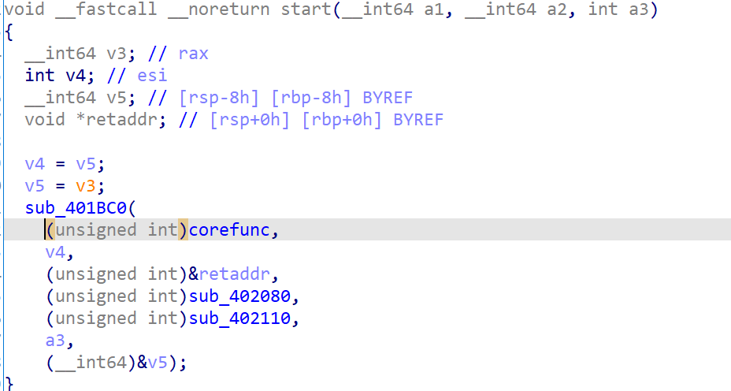

那么除了start，还有哪些函数会在执行期间被调用呢？

注意elf文件的两个段：

[“我们看.init和.fini这两段，其类型为PROGBITS，这表明这两个段的内容为可执行指令。.init段包含了程序在执行前所需要的初始化操作，使用C语言编程时入口是main，这部分代码就是main在执行前所需要运行的指令。当程序运行结束后，.fini中对应的代码会被执行已完成资源回收等操作。”](https://cloud.tencent.com/developer/article/1747676)

《程序员的自我修养》里，**第4章：静态链接一章中C++的全局构造与析构一节**，和**第11章：运行库**描述了这两个段。

除了init和fini，init_array和fini_array也是同样的作用。在elf文件里，他们的调用体现在**\__libc_csu_init 和 __libc_csu_fini**。看没有被去掉名称的文件就可以看出来：

左边是这道题，右边是SimpleRev。因此可以给这两个函数还原名字。

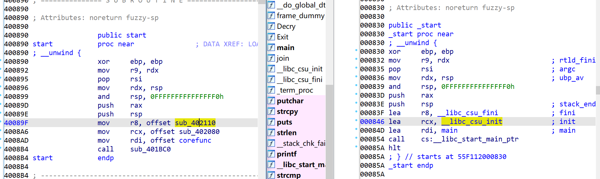

这么一看其实我们的corefunc就是main函数。

再来仔细看lib_csu_init函数和lib_csu_fini函数里的内容：

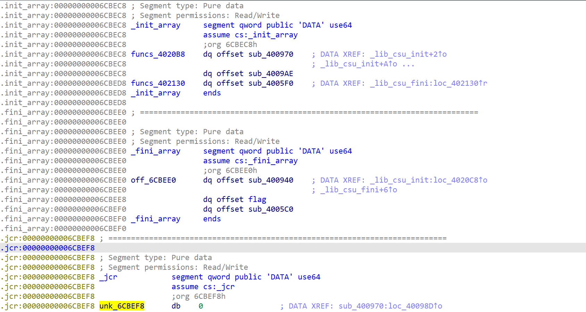

lib_csu_init函数是调用从funcs_4020b8到off_6cbee0中所有函数指针指向的函数：

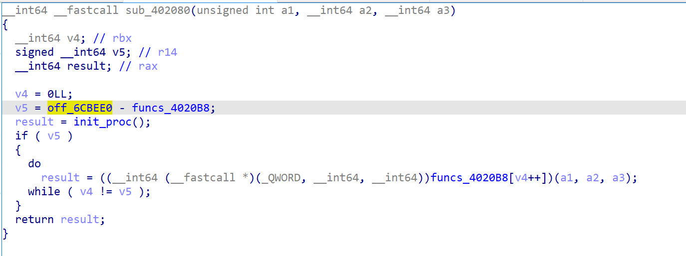

lib_csu_fini函数是调用unk_6cbef8到off_6cbee0中间所有函数指针指向的函数。

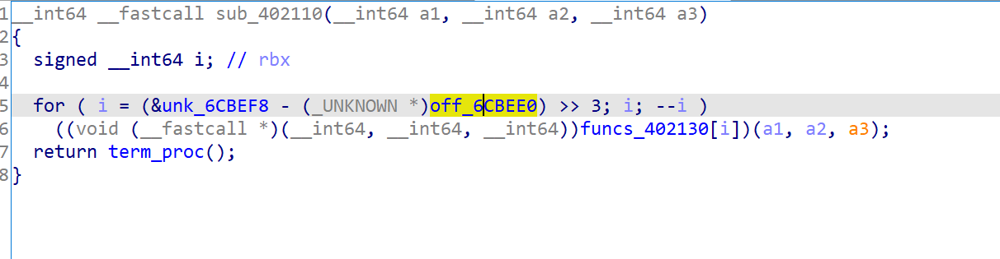

因此，在这两个阶段被调用的函数有：

sub_400970，sub_4009AE，sub_4005F0，sub_400940，sub_4005C0和我们的核心函数flag。

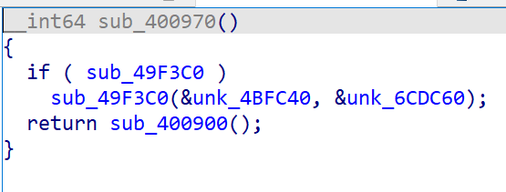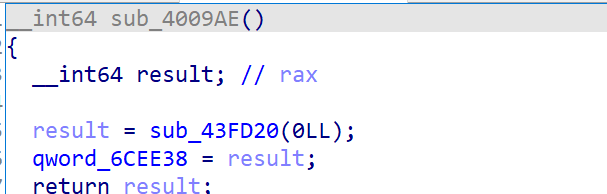

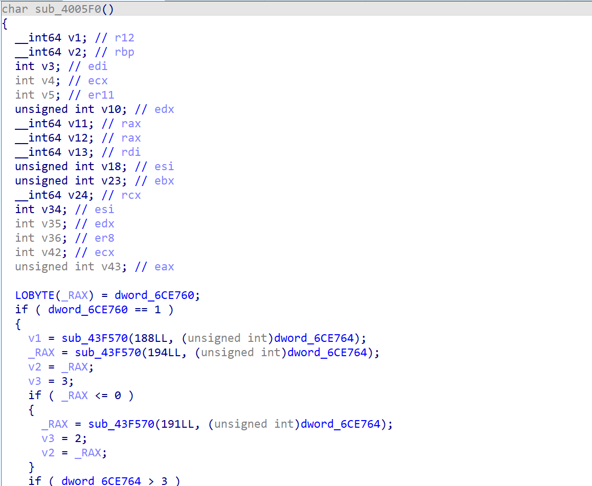

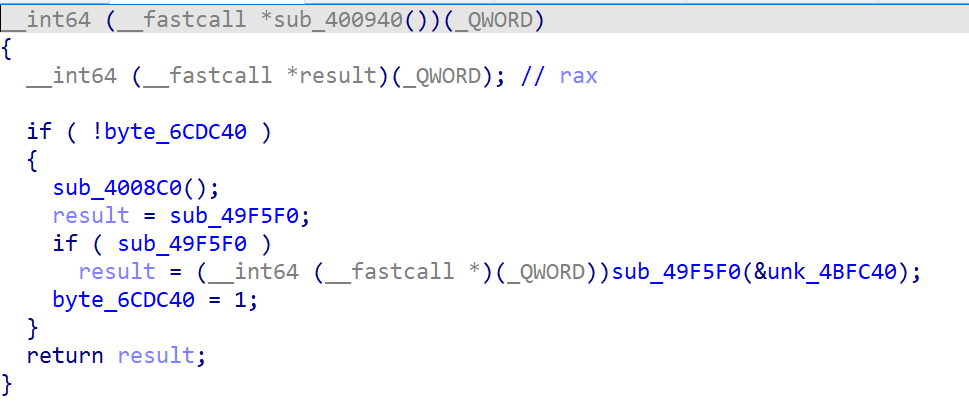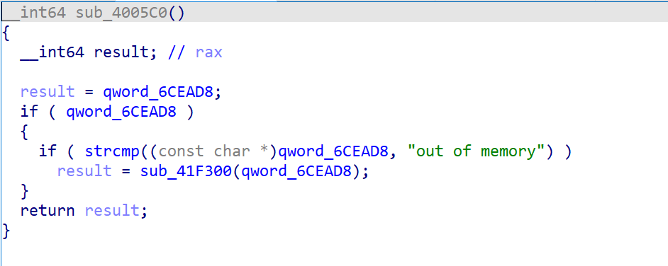

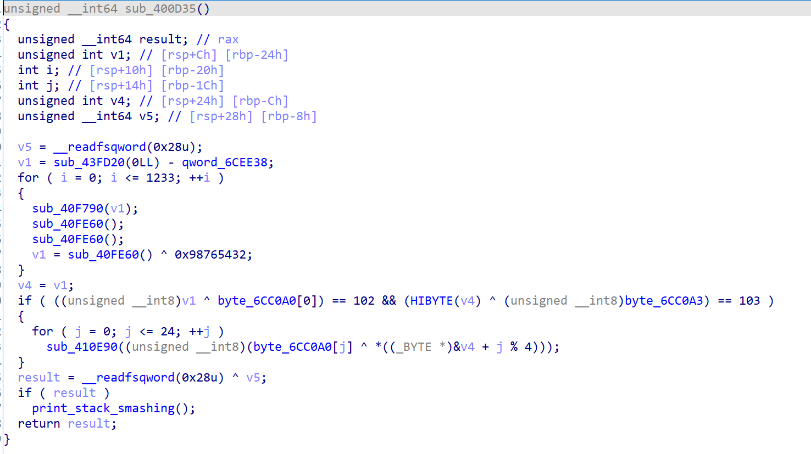

4005f0虽然也很复杂，但是有cpuid这种东西，因此先暂时排除它一下。这样，flag函数才有理有据地进入了我们的视线。

## 解密

前面一大堆乱七八糟求v1的看不懂，但是最好把第20行的数字转换成char看看，发现一个是f一个是g。

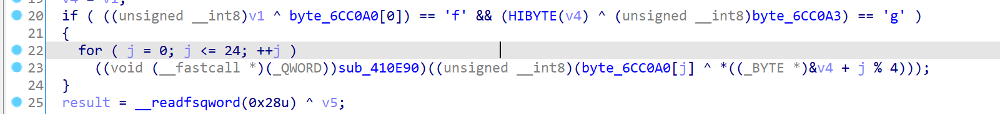

观察for循环里的代码，v4只使用了前4位。结合前面的提示，v7的前四位异或byte_6cc0a0的前四位为flag。求出v7，再和字符串循环异或就好了。

```python
char1 = [0x40, 0x35, 0x20, 0x56, 0x5D, 0x18, 0x22, 0x45,
         0x17, 0x2F, 0x24, 0x6E, 0x62, 0x3C, 0x27, 0x54,
         0x48, 0x6C, 0x24, 0x6E, 0x72, 0x3C, 0x32, 0x45, 0x5B]
str1 = ["f","l","a","g"]
for i in range(4):
    str1[i] = chr(char1[i]^ ord(str1[i]))
flag = ""
for i in range(25):
    flag += chr(char1[i] ^ ord(str1[i%4]))
print(flag)
```

注意不要直接复制ida里的字符串，而是写成十六进制。

flag{Act1ve_Defen5e_Test}