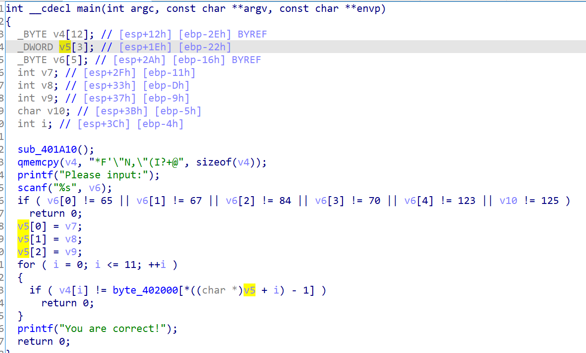

放到exeinfope里，发现需要脱壳，使用upx脱壳机脱壳。



放到ida里查看，边看边还原代码。注意一下v4[i]那一行，别逆错了。

```python
v4= list("*F'\"N,\"(I?+@")
v6 = [0]*5
v6[0] = 65
v6[1] = 67
v6[2] = 84
v6[3] = 70
v6[4] = 123
v10 = 125
x = ""
for i in range(5):
    x += chr(v6[i])
v5 = [0] * 12
print(x)
byte_402000 ="7E 7D 7C 7B 7A 79 78 77 76 75 74 73 72 71 70 6F 6E 6D 6C 6B 6A 69 68 67 66 65 64 63 62 61 60 5F \
5E 5D 5C 5B 5A 59 58 57 56 55 54 53 52 51 50 4F 4E 4D 4C 4B 4A 49 48 47 46 45 44 43 42 41 40 3F \
3E 3D 3C 3B 3A 39 38 37 36 35 34 33 32 31 30 2F 2E 2D 2C 2B 2A 29 28 27 26 25 24 23 20 21 22 00"
byte_402000 = byte_402000.split(" ")
byte = []
for i in range(len(byte_402000)):
    byte.append(int(byte_402000[i],16))
    
for i in range(12):
    for j in range(len(byte)) :
        if (v4[i] == chr(byte[j-1])):
            v5[i] = j

out = ""
for i in range(12):
    out += chr(v5[i])
print(out)
```

ACTF{

U9X_1S_W6@T?

flag就是flag{U9X_1S_W6@T?}