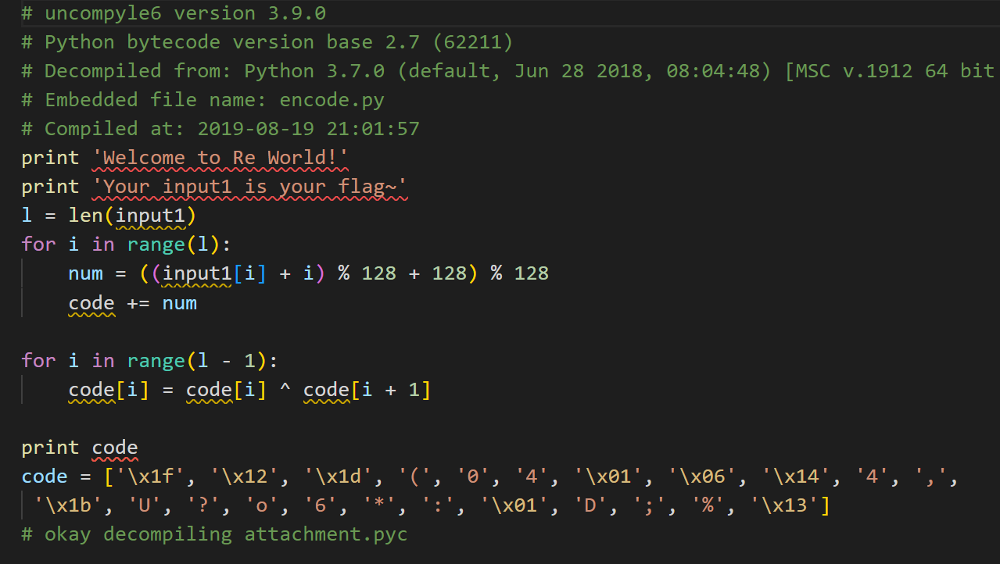

从名字看出来是一个python逆向。这次不头铁了，看见ida无法识别直接找工具。

uncompyle6，pip安装之后反编译：



python2也能看懂

第一个逻辑爆破第二个逻辑逆向：

```python
code = ['\x1f', '\x12', '\x1d', '(', '0', '4', '\x01', '\x06', '\x14', '4', ',', 
 '\x1b', 'U', '?', 'o', '6', '*', ':', '\x01', 'D', ';', '%', '\x13']
l = len(code)
for i in range(l-1):
    code[0-i-2] = chr(ord(code[0-i-2]) ^ ord(code[0-i-1]))
print(code)
input = ""
for i in range(l):
    for j in range(128):
        if ord(code[i]) == ((j + i) % 128 + 128) % 128:
            input+= chr(j)
print(input)
```

GWHT{Just_Re_1s_Ha66y!}

flag{Just_Re_1s_Ha66y!}

如果实在要逆向第一个逻辑可以先化简：

```python
ord(code[i]) == ((j + i) % 128)
->
(j + i) = k*128 + ord(code[i])
->
j = (k*128 + ord(code[i]) -i) % 128
```

由于j是可打印字符，k使用1就行，为了保证不超过128最后再模128，得到的结果和上面一样。（但不确定方法是否泛用）

```python
code = ['\x1f', '\x12', '\x1d', '(', '0', '4', '\x01', '\x06', '\x14', '4', ',', 
 '\x1b', 'U', '?', 'o', '6', '*', ':', '\x01', 'D', ';', '%', '\x13']
l = len(code)
print(l)
for i in range(l-1):
    code[0-i-2] = chr(ord(code[0-i-2]) ^ ord(code[0-i-1]))
print(code)
input = ""
for i in range(l):
    j = (128 + ord(code[i]) -i) % 128
    input+= chr(j)
print(input)
```


