# 刮开有奖

32位程序，运行一下看，弹出一个刮开有奖的窗口，鼠标倒是无法刮奖。

开ida，找到main，照例先看一下string，发现base64

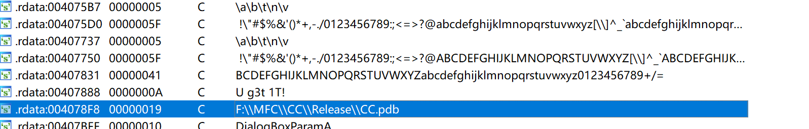

找到main，百度了一下DialogBoxParamA函数，需要注意的是其第四个参数：lpDialogFunc是对话框的消息处理函数。

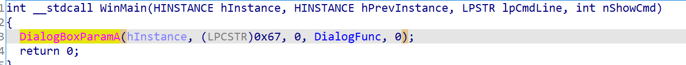

打开od，打开查看-》可执行模块窗口，双击主模块，往下滑动找到DialogBoxParamA：F2给其下断点。

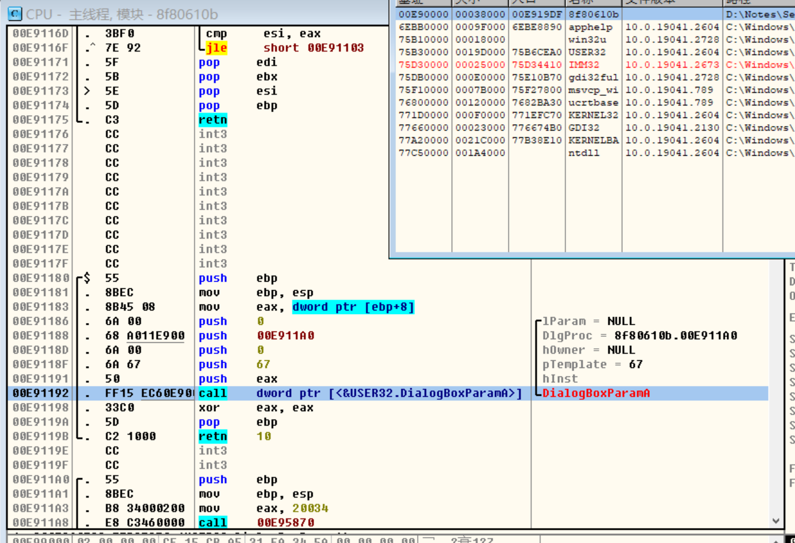

再往下滑发现有个GetDlgItemTextA，发现这就是消息处理函数，在prolog处下断点：

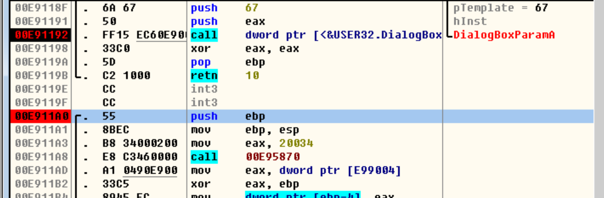

将ida的多屏协作打开，将伪代码与汇编同步，同时找到od的核心代码开始的地方：

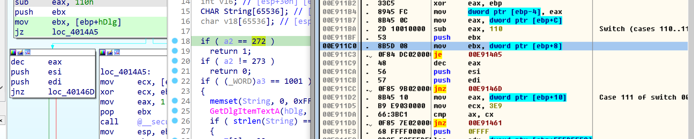

开始单步调试。注意到这里有一个明显矛盾的地方：

a2==272，返回；a2！=273，返回。因此这里无论如何都会返回，所以要修改掉这部分：

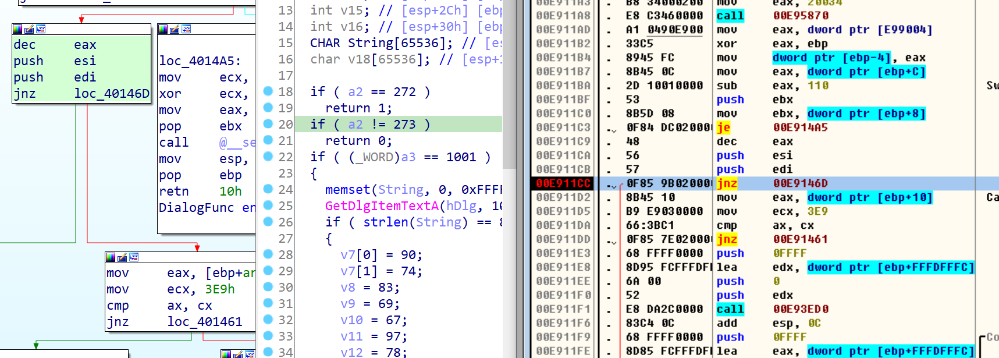

可以用nop patch掉：选中这一行，按空格，输入nop即可。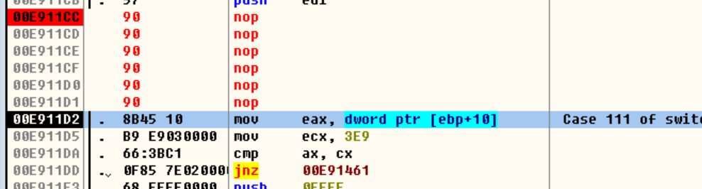

下面几个判断用同样的方法：

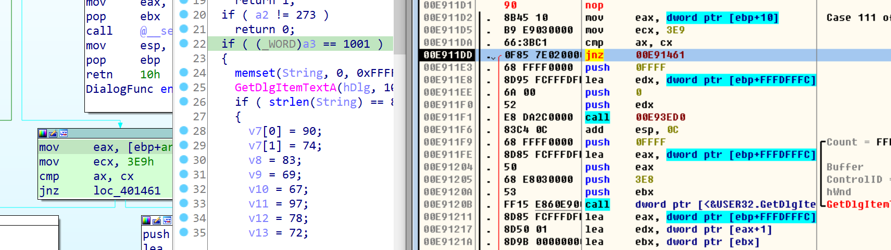

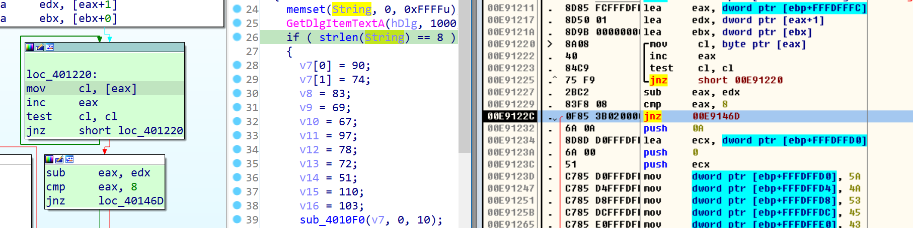

接下来这一堆很明显是往栈里写数据：

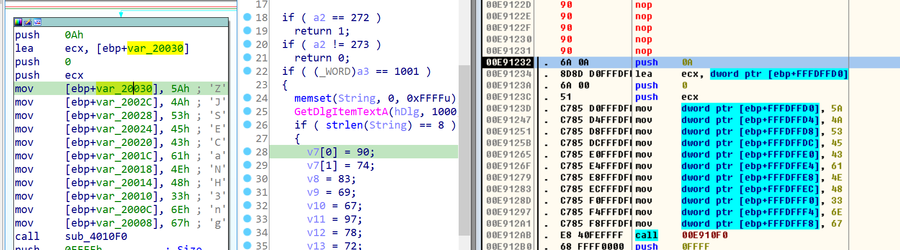

调试之后查看v7开头的栈的值：很明显就是按顺序的。

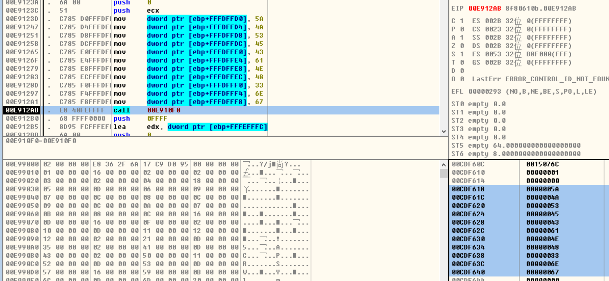

接下来查看sub 4010f0函数对v7做处理的内容：

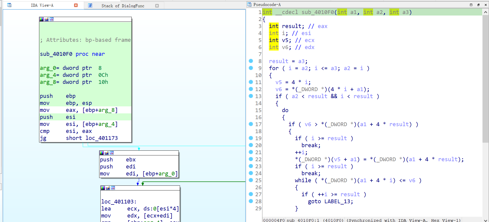

可以直接在od中记住这个栈地址，直接运行到ret，就能得到修改之后的v7的值。注意这个函数是递归的，因此需要记住递归次数。最后，调试证明这是个不稳定的排序（大概率是快排？抓紧复习一下）。第一轮：

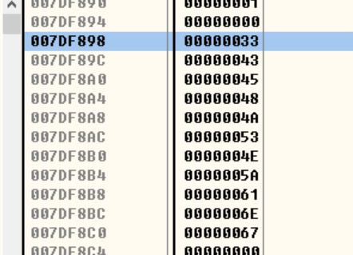

最后一轮：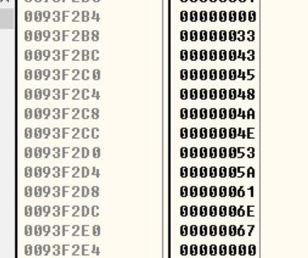

v7 []="3CEHJNSZagn"

接下来观察下面的代码：

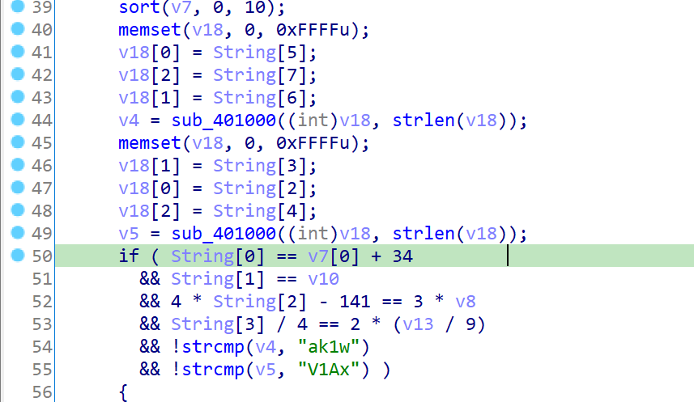

string[8]是我们不知道的东西，它的位置在v7字符串后面；先使用它的一部分算出来v4，再算出来v5,；最后有6个比较，只要这6个都成立，我们就算成功了。因此我们需要根据这6个条件推断出这个字符串数组，把它拼接到v7后面即可。sub 401000看起来和base64相关。

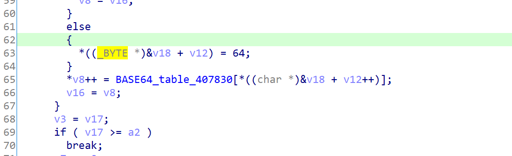

首先string[0] = v7[0]+34 = 85; string[1] = 74; 4*string[2]-141 = 207, string[2] = 87; string[3] = 8\*10 = 80; 

因此优先看v5；v18 = “WP?”，先base64解码V1Ax，得到WP1，因此sub 401000就是普通的base64，因此直接对v4解码即可。String[4] = "1"; jMp, string[5] = j, string[6] = M, string[7] = p

因此string = "UJWP1jMp"。由于题目说是需要输入的值，因此只能是string数组的值。

flag = flag{UJWP1jMp}

做题的时候把"3"的ascii想成31了我说怎么都算不对。。。